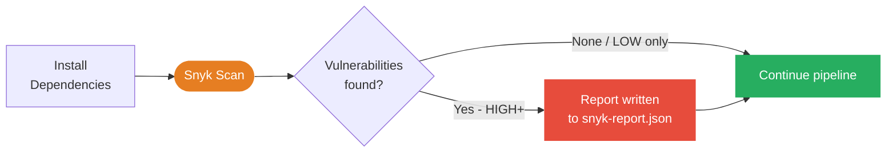
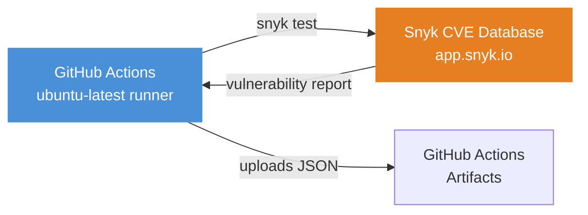
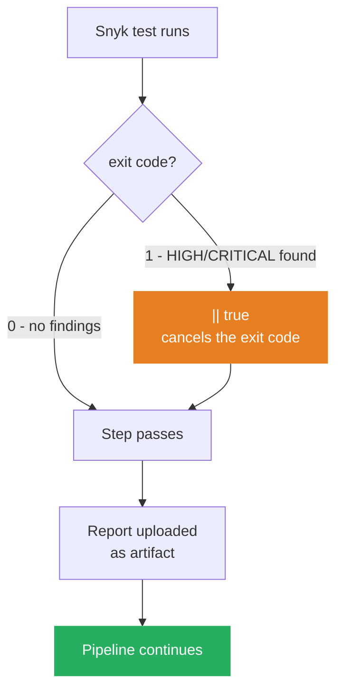

# Snyk Setup Guide — FitForge CI

## What Is Snyk?

Snyk is a **Software Composition Analysis (SCA)** tool. It scans your declared dependencies (`package.json`, `requirements.txt`) and checks every package — including transitive ones — against the Snyk CVE database.

### How Snyk Fits in the Pipeline



### What Snyk Catches vs Other Tools

| Tool | What It Scans | Stage |
|---|---|---|
| **Snyk** | Known CVEs in `node_modules` / pip packages | After `npm ci` |
| **SonarQube** | Your own source code — bugs, security hotspots | After install |
| **Trivy** | Built Docker image — OS packages + app layer | After `docker build` |

These three tools complement each other. Example:
- Snyk finds `lodash@4.17.15` has a Prototype Pollution CVE
- SonarQube finds you are calling `eval()` unsafely in your code
- Trivy finds the `node:20-alpine` base image has an unpatched OpenSSL CVE

---

## Do You Need an EC2 for Snyk?

**No.** Snyk requires zero infrastructure from you.



The Snyk CLI authenticates to `app.snyk.io` using your token and fetches the vulnerability database. The runner does all the work — there is nothing to host.

> The only infrastructure you need to set up is the EC2 instance for SonarQube.

---

## Step 1 — Create a Free Snyk Account

1. Go to [https://app.snyk.io/login](https://app.snyk.io/login)
2. Click **Sign up with GitHub** — Snyk uses your GitHub identity, no email verification needed
3. Authorize Snyk to read your profile (repo access is **not** required for CLI-based scanning)
4. Complete the onboarding and arrive at the Snyk dashboard

---

## Step 2 — Get Your API Token

1. Click your **profile icon** in the top-right corner of the Snyk dashboard
2. Click **Account settings**
3. Under **Auth Token**, click **Click to show**
4. Copy the token — it looks like `xxxxxxxx-xxxx-xxxx-xxxx-xxxxxxxxxxxx`

> **Treat this token like a password.** Anyone who has it can run scans billed to your account.

---

## Step 3 — Add Token to GitHub Secrets

1. Go to your GitHub repository
2. Navigate to **Settings → Secrets and variables → Actions**
3. Click **New repository secret**
4. Set **Name** to `SNYK_TOKEN` and **Value** to your token
5. Click **Add secret**

---

## Step 4 — How Snyk Is Configured in the CI Template

The reusable template in `_ci-template.yml` already includes Snyk. Here is the relevant section:

**For Node services:**

```yaml
- name: Setup Snyk CLI
  uses: snyk/actions/setup@master

- name: Snyk — Scan dependencies (Node)
  run: snyk test --severity-threshold=high --json > snyk-report.json || true
  env:
    SNYK_TOKEN: ${{ secrets.SNYK_TOKEN }}

- name: Upload Snyk report
  uses: actions/upload-artifact@v4
  if: always()
  with:
    name: snyk-report-${{ inputs.service-name }}
    path: ${{ inputs.service-path }}/snyk-report.json
    retention-days: 14
```

**For the Python AI agent service:**

```yaml
- name: Snyk — Scan dependencies (Python)
  run: snyk test --file=requirements.txt --package-manager=pip --severity-threshold=high --json > snyk-report.json || true
  env:
    SNYK_TOKEN: ${{ secrets.SNYK_TOKEN }}
```

### Flag Reference

| Flag | Meaning |
|---|---|
| `--severity-threshold=high` | Only exit non-zero for HIGH and CRITICAL findings |
| `--json` | Output results as JSON instead of plain text |
| `> snyk-report.json` | Save the output to a file |
| `\|\| true` | Prevent the step from failing the pipeline (report-only mode) |

---

## Step 5 — Report-Only vs Blocking Mode

The template ships with `|| true` — Snyk will **report findings but never block** the pipeline.



**When you are ready to enforce blocking**, remove `|| true` from the Snyk step:

```yaml
# Before — report only
run: snyk test --severity-threshold=high --json > snyk-report.json || true

# After — pipeline fails on HIGH/CRITICAL
run: snyk test --severity-threshold=high --json > snyk-report.json
```

> **Recommendation:** Start in report-only mode for the first few days to see the existing vulnerability backlog before enforcing blocking.

---

## Step 6 — Reading the Snyk Report

After a pipeline run, download the report from the **Artifacts** section of the GitHub Actions run page.

**JSON structure:**

```json
{
  "ok": false,
  "dependencyCount": 342,
  "uniqueCount": 3,
  "vulnerabilities": [
    {
      "id": "SNYK-JS-LODASH-567746",
      "title": "Prototype Pollution",
      "severity": "high",
      "packageName": "lodash",
      "version": "4.17.15",
      "fixedIn": ["4.17.21"],
      "description": "..."
    }
  ]
}
```

| Field | Meaning |
|---|---|
| `ok` | `false` = vulnerabilities found |
| `dependencyCount` | Total packages scanned |
| `uniqueCount` | Distinct CVEs found |
| `fixedIn` | Version that resolves the CVE |

---

## Step 7 — Fixing Vulnerabilities

### Option A — Upgrade the package

```bash
cd services/auth-service

# Upgrade to the latest patch
npm update lodash

# Or pin to a specific safe version
npm install lodash@4.17.21
```

Commit the updated `package-lock.json`. The next CI run will pick up the fix.

### Option B — Ignore a false positive

If the CVE does not affect the way your code uses the library, create a `.snyk` policy file in the service directory:

```yaml
# services/auth-service/.snyk
version: v1.25.0
ignore:
  SNYK-JS-LODASH-567746:
    - "*":
        reason: "We do not call merge() with user-controlled input"
        expires: "2026-12-31T00:00:00.000Z"
```

### Option C — Snyk Fix PRs (optional)

Import your repository in the Snyk dashboard under **Projects → Import**. Snyk will open automated pull requests with dependency upgrades. This is free on the Snyk free tier.

---

## Snyk Free Tier Limits

| Feature | Free Tier |
|---|---|
| Open-source CLI scans | Unlimited |
| Container scans | 100 / month |
| IaC scans | 300 / month |
| Collaborators | Up to 3 |
| Automated fix PRs | Yes |

For 7 microservices running CLI-based scans, the free tier is more than sufficient.

---

## Local Development Commands

You can also run Snyk locally during development before pushing:

```bash
# Install Snyk CLI globally
npm install -g snyk

# Authenticate (opens browser)
snyk auth

# Scan the current Node project
cd services/auth-service
snyk test

# Scan and show only HIGH and above
snyk test --severity-threshold=high

# Scan a Python project
snyk test --file=requirements.txt --package-manager=pip

# Get upgrade advice
snyk test --json | snyk-to-html -o report.html

# Upload a snapshot to the Snyk dashboard for monitoring
snyk monitor
```
